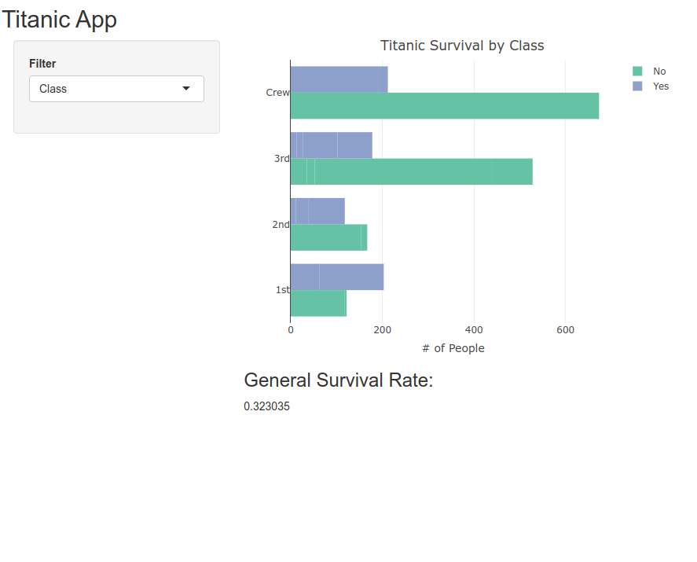
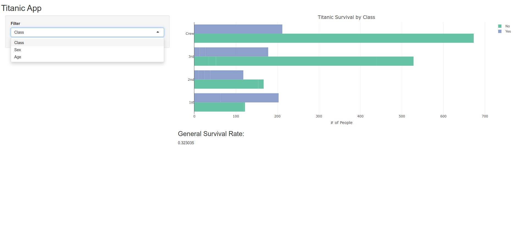

## Dataset

This application is using Titanic dataset.

`datasets(Titanic)`

## Application

The App has drop down that can be selected to show survival plot based on certain column, e.g: Sex, Class, Age.
It will also shows the general survival rate.

Application developed using `shiny`. It is hosted on [`shinyapps.io`](https://irvifa.shinyapps.io/titanic-app/). Code is available in [github](https://github.com/irvifa/data/tree/main/johns-hopkins-university/developing-data-product/shiny).

## Screenshots

{width=80%}

## Screenshots (Con't)

{width=80%}

## Thank you