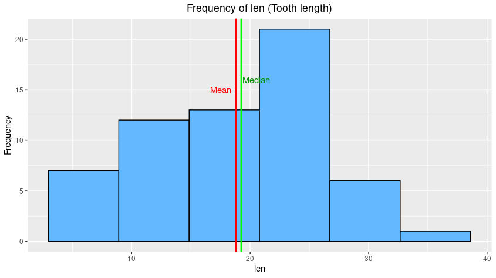
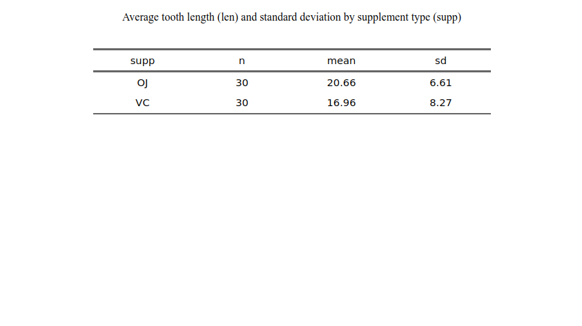
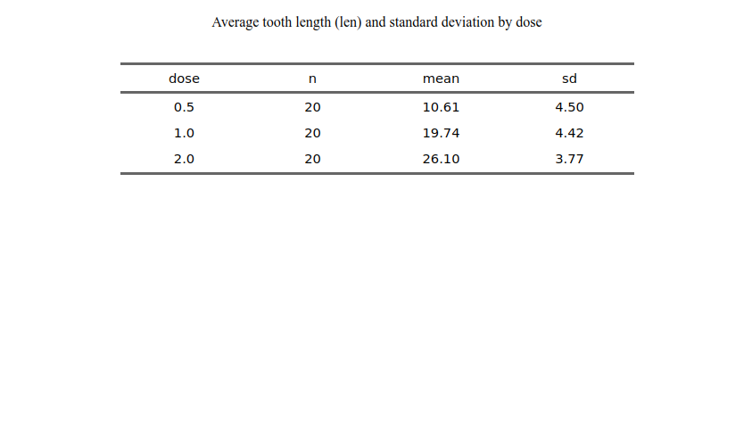
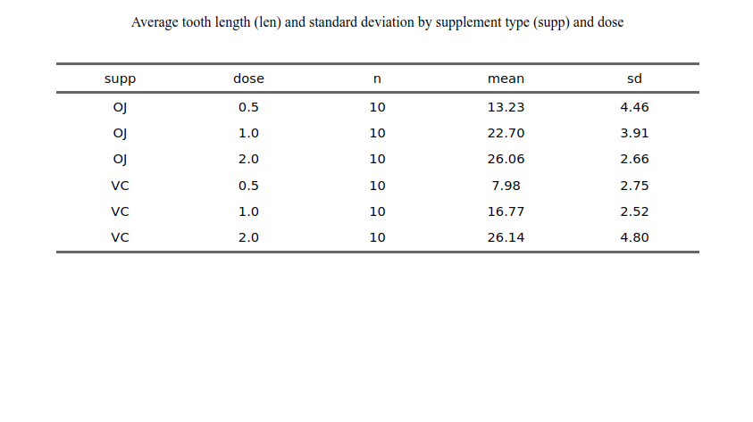
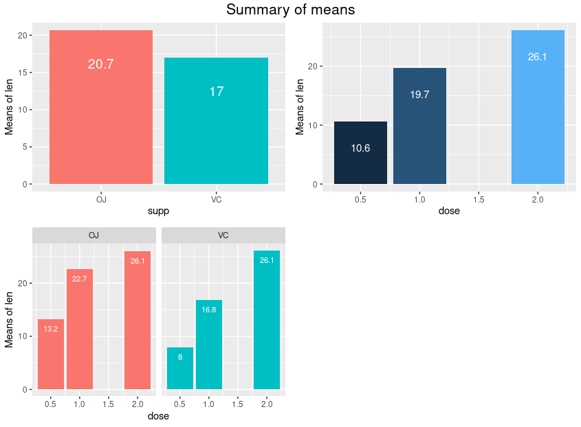

# Basic Inferential Statistics

In this section, we are going to analyze the ToothGrowth dataset from the R dataset package. There are the following steps that we need to do for the experiment:

- performing basic exploratory data analysis on ToothGrowth dataset
- providing a basic summary of the data.
- using hypothesis testing and/or confidence intervals in order to compare tooth's growth by supplement and dose
- providing assumptions and conclusions for the experiment


## Basic Exploratory Data Analysis

Load necessary package for the experiment.

```R
library(tidyverse)
library(grid)
library(gridExtra)
library(flextable)
```

First, we need to know what is the dataset about. To do this we can use `?ToothGrowth` command through the console. Based on the RDocumenttaion, the dataset is about:

> 
ToothGrowth {datasets}	R Documentation
The Effect of Vitamin C on Tooth Growth in Guinea Pigs
Description
The response is the length of odontoblasts (cells responsible for tooth growth) in 60 guinea pigs. Each animal received one of three dose levels of vitamin C (0.5, 1, and 2 mg/day) by one of two delivery methods, orange juice or ascorbic acid (a form of vitamin C and coded as VC).

Usage
ToothGrowth
Format
A data frame with 60 observations on 3 variables.

[,1]	len	numeric	Tooth length
[,2]	supp	factor	Supplement type (VC or OJ).
[,3]	dose	numeric	Dose in milligrams/day
Source
C. I. Bliss (1952). The Statistics of Bioassay. Academic Press.

References
McNeil, D. R. (1977). Interactive Data Analysis. New York: Wiley.

Crampton, E. W. (1947). The growth of the odontoblast of the incisor teeth as a criterion of vitamin C intake of the guinea pig. The Journal of Nutrition, 33(5), 491–504. doi: 10.1093/jn/33.5.491.

Examples
require(graphics)
coplot(len ~ dose | supp, data = ToothGrowth, panel = panel.smooth,
       xlab = "ToothGrowth data: length vs dose, given type of supplement")

We can understand that the of the variables: len is numeric, supp is a factor (can be OJ or VC) and dose is numeric.

To understand the dataset attributes better we can do:
```R
str(ToothGrowth)
# 'data.frame':	60 obs. of  3 variables:
# $ len : num  4.2 11.5 7.3 5.8 6.4 10 11.2 11.2 5.2 7 ...
# $ supp: Factor w/ 2 levels "OJ","VC": 2 2 2 2 2 2 2 2 2 2 ...
# $ dose: num  0.5 0.5 0.5 0.5 0.5 0.5 0.5 0.5 0.5 0.5 ...
```

Getting the description of the variable `supp`:

```R
summary(ToothGrowth$supp)
# OJ VC 
# 30 30 
```

Getting the desription the variable `dose`: in this variable we have 3 levels: 0.5, 1.0 and 2.0, all of 20 observations each.

```R
ToothGrowth %>% group_by(dose) %>% count()
# A tibble: 3 × 2
# Groups:   dose [3]
#   dose     n
#  <dbl> <int>
# 1   0.5    20
# 2   1      20
# 3   2      20
```

Getting the description of the variable `len`:

```R
summary(ToothGrowth$len)
#    Min. 1st Qu.  Median    Mean 3rd Qu.    Max. 
#    4.20   13.07   19.25   18.81   25.27   33.90 
```

So, the very small difference between median and mean indicates the lack of skewness in the sample distribution, as we can see in the following histogram


```R
ggplot(ToothGrowth, aes(x=len))+
  geom_histogram(bins = 6, fill= "steelblue1", colour="black")+
  geom_vline(xintercept = mean(ToothGrowth$len),lwd=1,colour="red")+
  geom_vline(xintercept = median(ToothGrowth$len),lwd=1,colour="green")+
  annotate("text",c(17.5,20.5),c(15,16),
           label=c("Mean","Median"),
           colour= c("red","green4"))+
  ylab("Frequency")+
  ggtitle("Frequency of len (Tooth length)")+
  theme(plot.title = element_text(hjust = 0.5))
```



## Providing Basic Summary of the Dataset

Based on previous exploration we have one response variable (len) and two explanatory variables (app and dose), which try to explain the response.

We will build a summary, grouping len in relation to dose and supp.

We obtain three different tables that summarize the averages of the variable len (Tooth lengths) in relation to supp (Supplement type) and dose.

```R
ToothGrowth %>% group_by(supp) %>% summarise(n=n(),
                                             mean=round(mean(len),2),
                                             sd=round(sd(len),2)) %>% 
  flextable() %>%
  align(align = "center",part = "all")%>%
  set_caption(caption = "Average tooth length (len) and standard deviation by supplement type (supp)")%>%
  width(width = 1.5)
```



Then, we need to obtain another table which summarize the averages of the variable len (Tooth lengths) in relation to dose.

```R
ToothGrowth %>% group_by(dose) %>% summarise(n=n(),
                                             mean=round(mean(len),2),
                                             sd=round(sd(len),2)) %>% 
  flextable() %>%
  align(align = "center",part = "all")%>%
  set_caption(caption = "Average tooth length (len) and standard deviation by dose")%>%
  width(width = 1.5)
```




Next, we need to obtain another table which summarize the averages of the variable len (Tooth lengths) in relation to supplement type and dose.

```R
ToothGrowth %>% group_by(supp,dose) %>% summarise(n=n(),
                                                  mean=round(mean(len),2),
                                                  sd=round(sd(len),2)) %>% 
  flextable() %>%
  align(align = "center",part = "all")%>%
  set_caption(caption = "Average tooth length (len) and standard deviation by supplement type (supp) and dose")%>%
  width(width = 1.5)

```






The summaries of the data indicate a possible correlations of both variables supp and dose with the response variable len. Which will be our alternative hypothesis in the hypothesis test of the next chapter.

## Using Hypothesis Testing and/or Confidence Intervals in Order to Compare Tooth's Growth by Supplement Type and Dose


### Comparison Between Dose = 0.5 and Dose = 1.0

We will use control group of when $ dose = 0 $. Next, we are comparing $ dose = 0.5 $ and $ dose = 1.0$.

**Hypothesis**

$$ H_0: \mu_{0.5} = \mu_{1.0} => \mu_{0.5} - \mu_{1.0} = 0 $$
$$ H_A: \mu_{0.5} \neq \mu_{1.0 } => \mu_{0.5} - \mu_{1.0} \neq 0 $$

Next, we will obtain the p-values using the `t.test()` function, which we have seen es being the quickest option. We will use the same option, `var.equal=FALSE`, which computes the df using the Welch option. And the confidence level is 95%.

```R
t1<-t.test(ToothGrowth$len[ToothGrowth$dose== 0.5],
       ToothGrowth$len[ToothGrowth$dose== 1],
       paired = FALSE,
       alternative = "two.sided",
       var.equal = FALSE,
       conf.level = .95)$p.value
t1
# [1] 1.268301e-07
```

In this case the p-value is equal to 0.0000001. Which allows us to reject $ H_0 $.

### Comparison Between Dose = 0.5 and Dose = 1.0

We will use control group of when $ dose = 0 $. Next, we are comparing $ dose = 1.0 $ and $ dose = 12.0 $.

**Hypothesis**

$$ H_0: \mu_{1.0} = \mu_{2.0} => \mu_{1.0} - \mu_{2.0} = 0 $$
$$ H_A: \mu_{1.0} \neq \mu_{2.0} => \mu_{1.0} - \mu_{2.0} \neq 0 $$

Next, we will obtain the p-values using the `t.test()` function, which we have seen es being the quickest option. We will use the same option, `var.equal=FALSE`, which computes the df using the Welch option. And the confidence level is 95%.

```R
t2<-t.test(ToothGrowth$len[ToothGrowth$dose== 1],
       ToothGrowth$len[ToothGrowth$dose== 2],
       paired = FALSE,
       alternative = "two.sided",
       var.equal = FALSE,
       conf.level = .95)$p.value
t2
# [1] 1.90643e-05
```

In this case the p-value is equal to 1.90643e-05. Which allows us to reject $ H_0 $ even when the sample is smaller ($ \alpha $ is smaller).

##  Conclusions and Assumptions

- The difference observed in the sample between the averages of tooth's length (len) by supplement type (supp) is not enough to reject the null hypothesis and to be considered statistically significant. So we can’t say that the supplement type has any correlation with tooth length.
- The difference observed in the sample between the averages of tooth's length (len) by dose is enough to reject the null hypothesis in the case of doses of 0.5 and 1.0. So we can infer that to increase the dose from 0.5 to 1.0 has a correlation with tooth length. On the other hand we have to note tha this correlation has an high power that could allow us to get the same outcome even with smaller samples.
- The difference observed in the sample between the averages of tooth's length (len) by d is enough to reject the null hypothesis in the case of doses of 1.0 and 2.0. So we can infer that to increase the dose from 1.0 to 2.0 has a correlation with tooth length. As in the previous case, we have to note that this correlation has an high power that could allow us to get the same outcome even with smaller samples ($ smaller \alpha $).


Eventually, we have we can state that it exist a very robust correlation between dose of the supplement and tooth length; while the correlation between supplement type and tooth length is unclear.
