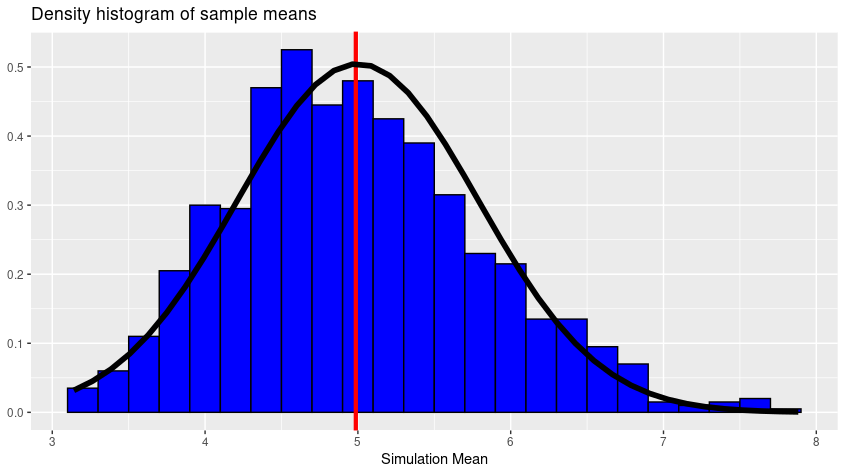

# Simulating Exponential Distribution

## Introduction

The purpose of this project is investigating the exponential distribution in R and compare it with the Central Limit Theorem (CLT). In order to be able to conduct the experiment we will need to calculate the sample mean and variance then comparing it with the theoretical values. After that we will plot the distribution of sample means and shows that it is approximately normal.

## Experiment

In order to make the experiment reproducible we will need to set the seed:

```R
set.seed(42)
```

Next, we will need to set the following parameters:
- the distribution parameters (lambda)
- sample size (sample_size)
- number of simulations (number_of_simulations)

```R
lambda <- 0.2
sample_size <- 40
number_of_simulations <- 1000
```

We will need to calculate:
- the theoretical mean (mu)
- standard deviation (sd)

```R
mu <- 1/lambda
sd <- 1/lambda
```

We will sample 40 variables from the distribution 1000 times, and create a matrix (named sample.distr) with 40 columns and 1000 rows. Each row is a simulation and the columns are the sample variables.

```R
sample.distr <- matrix(
  data = rexp(sample_size*number_of_simulations,lambda), 
  nrow = number_of_simulations)
```

## Sample and Theoretical Means


After we calculate both of sample and theoretical mean, we compare that theoretical mean to sample means, we see that the values are pretty close.

```R
sample.means <- apply(sample.distr, 1, mean)
mu; mean(sample.means)
## [1] 5
## [1] 4.986508
```

Then, we can get the absolute difference between theoretical means and sample means.

```R
abs(mu-mean(sample.means))
# [1] 0.01349168
```

Next, we will compute the theoretical variance of the exponential distribution.

```R
sample.mean.var <- var(sample.means)
sample.mean.var
# [1] 0.6793521

theoretical.var <- 1/((lambda*sqrt(sample_size)))^2
theoretical.var; sample.mean.var
# [1] 0.625
# [1] 0.6793521
```

Then, we can get the absolute difference between theoretical variance and sample variance.

```R
abs(theoretical.var-sample.mean.var)
# [1] 0.05435207
```

## Plotting the Distribution of Sample Means


We know, by the CLT, that the distribution of sample means should be approximately normal, with a mean similar to the theoretical mean of the exponential distribution. We proved that the sample and theoretical means are pretty close.

A density histogram of the sample means is presented below. The vertical red line represents the mean of the distribution of sample means (4.986508). We can see that the distribution is approximately normal with a mean near 5 (the theoretical mean, mu, or 1/lambda). In addition, we will overlay a normal distribution curve using the theoretical mean and standard deviation parameters to show that this distribution is approximately normal.

We will use the `ggplot2` package to plot the distribution.

```R
library(ggplot2)

ggplot(data.frame(y = sample.means), aes (x = y)) +
  geom_histogram(aes(y =..density..),
                 binwidth = 0.2, fill = "blue", color = "black") +
  geom_vline(xintercept = mean(sample.means), 
             color = "red", size = 1.5) +
  stat_function(fun = dnorm, n = sample_size, 
                args = list(mean = 1/lambda, 
                            sd = 1/(lambda*sqrt(sample_size))), size = 2) +
  labs(title = "Density histogram of sample means",
       x = "Simulation Mean",
       y = NULL)
```


